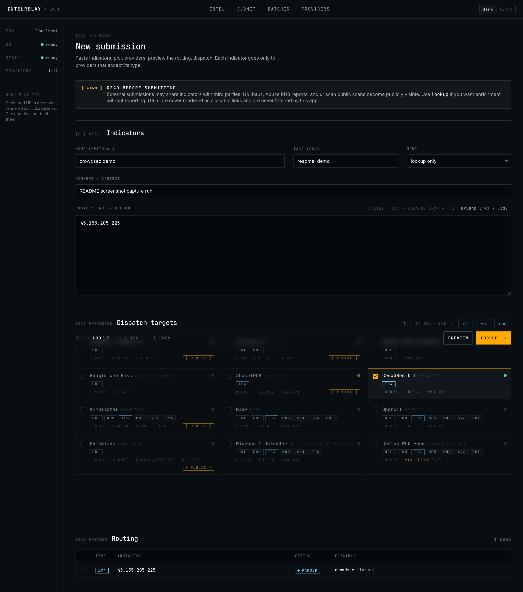
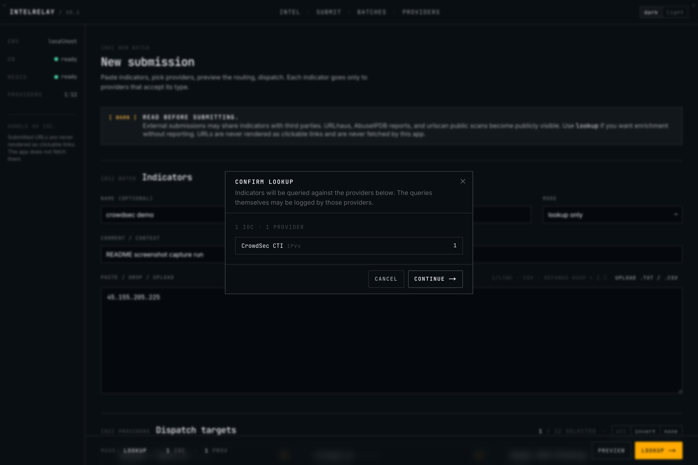
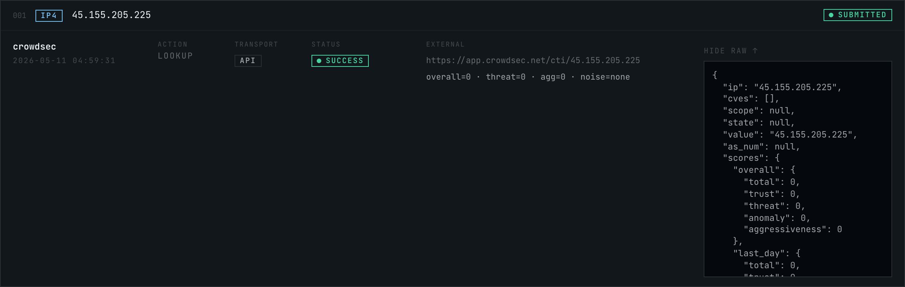

# IntelRelay

**API-first IOC submission router with safe browser-automation fallbacks for threat-intel platforms that do not provide submission APIs.**

IntelRelay lets you paste or upload a list of indicators of compromise (IOCs), preview the routing, pick the providers you want to hit, and dispatch each indicator only to providers that support it. Built on Next.js 15, Prisma, Postgres, Redis + BullMQ, and (optionally) Playwright.

---

## Screenshots

Paste indicators, pick providers, preview the routing — one screen.



Confirmation step before any external call is made.



Each provider attempt is logged with its full response body.



Captured from a live end-to-end run (`node scripts/e2e-crowdsec.mjs`) against a real CrowdSec API key. See `docs/screenshots/batch-detail.png` for the full batch page.

---

## Supported providers

| Provider | URL | Domain | IPv4 | Hash | Email | API | Playwright | Main action |
|---|:--:|:--:|:--:|:--:|:--:|:--:|:--:|---|
| URLhaus / abuse.ch       | yes |    |    |    |    | yes |    | submit malware URL |
| urlscan.io               | yes | yes |    |    |    | yes |    | scan URL |
| Google Safe Browsing     | yes |    |    |    |    | yes |    | lookup |
| Google Web Risk          | yes |    |    |    |    | yes |    | lookup |
| AbuseIPDB                |    |    | yes |    |    | yes |    | report / check IP |
| CrowdSec CTI             |    |    | yes |    |    | yes |    | lookup / enrich IP |
| VirusTotal               | yes | yes | yes | yes |    | yes |    | lookup / enrich / scan |
| MISP                     | yes | yes | yes | yes | yes | yes |    | submit / export |
| OpenCTI                  | yes | yes | yes | yes | yes | yes |    | submit / enrich |
| PhishTank                | yes |    |    |    |    | lookup | optional | lookup; submission via brittle Playwright path |
| Microsoft Defender TI    | yes | yes | yes | yes |    | yes |    | lookup / enrich |
| Custom Web Form          | yes | yes | yes | yes | yes |    | yes | configurable form submission |

---

## API-first design

For every provider:

1. Prefer the official API where available.
2. If no API is available, or the API can't perform the required action, optionally fall back to a Playwright browser-automation adapter.
3. Playwright adapters are **disabled by default** and clearly marked as brittle.
4. We never automate around CAPTCHAs, MFA, or anti-bot controls. If we detect them, the attempt is marked `manual_required`.

---

## Playwright fallback warning

Playwright adapters are a last resort. They:

- Run server-side only.
- Use selectors stored in provider config; no DOM scraping the user didn't configure.
- Take screenshots only on failure, written to `PLAYWRIGHT_SCREENSHOT_DIR`.
- Fail gracefully when CAPTCHA / MFA / bot challenges appear (`manual_required`).
- Will break if the target site changes — that's expected.

Do not enable Playwright against providers whose terms of service forbid it.

---

## Local setup

### 1. Prerequisites

- Node.js 20+
- Docker + Docker Compose (for Postgres + Redis)

### 2. Install

```bash
cp .env.example .env
npm install
docker compose up -d
npx prisma generate
npx prisma migrate dev --name init
```

### 3. Run

```bash
npm run dev         # Next.js dev server on http://localhost:3000
npm run worker      # BullMQ worker (separate terminal)
```

If `PLAYWRIGHT_ENABLED=true`, install browser binaries:

```bash
npx playwright install --with-deps chromium
```

### 4. Tests

```bash
npm run test
```

Tests cover the indicator parser and the routing engine. They do **not** hit any real provider APIs.

---

## Environment variables

See `.env.example` for the full list. Highlights:

- `DATABASE_URL`, `REDIS_URL` — required.
- `MAX_INDICATORS_PER_BATCH` (default `500`) — hard cap per batch.
- `QUEUE_ENABLED`, `QUEUE_BATCH_THRESHOLD` — when total provider attempts >= threshold, work is pushed to BullMQ; otherwise it runs synchronously inside the API request.
- `PLAYWRIGHT_ENABLED` — master kill-switch for Playwright. Off by default.
- Each provider has `_ENABLED` and credential vars. Provider is unavailable until both are set.

API keys are read on the server only. They are **never** returned to the browser, and they're redacted from request payloads stored in `ProviderAttempt.requestPayload`.

---

## Provider setup notes

### URLhaus

- Anonymous submission allowed. Add `URLHAUS_AUTH_KEY` to associate submissions with your account.
- Submissions are public.

### urlscan.io

- Requires `URLSCAN_API_KEY`.
- Default visibility is `unlisted`. Override via `URLSCAN_DEFAULT_VISIBILITY` (`public` | `unlisted` | `private`).

### Google Safe Browsing

- Lookup-only. If a user picks `submit` mode, this provider is skipped per routing rules.

### Google Web Risk

- Commercial / enterprise endpoint. Disabled by default.

### AbuseIPDB

- Reports require category IDs and a comment. The UI passes notes as the comment; pass categories via the API payload.

### CrowdSec CTI

- Lookup-only IPv4 reputation via `cti.api.crowdsec.net/v2/smoke/{ip}`. Requires `CROWDSEC_API_KEY` (free tier, register at `app.crowdsec.net`).
- No submit path: CrowdSec's community blocklist receives signals from CrowdSec agents, not from a generic reporting tool.

### VirusTotal

- Default mode is lookup/enrich. Active URL submission only happens when `VIRUSTOTAL_ALLOW_ACTIVE_URL_SCAN=true`.

### MISP

- Set `MISP_BASE_URL` + `MISP_API_KEY`.
- Events are **not** published automatically. Pass `publish: true` in extras to publish.
- Distribution defaults to `0` (your org only).

### OpenCTI

- GraphQL-based. Requires `OPENCTI_BASE_URL` + `OPENCTI_API_KEY`.

### PhishTank

- Lookup via API. Submission via Playwright is **off by default** and very brittle. Set `PHISHTANK_PLAYWRIGHT_ENABLED=true` only if you accept that risk.

### Microsoft Defender TI

- Uses Microsoft Graph with client-credentials flow. Provide tenant ID, client ID, client secret. No browser automation.

### Custom Web Form

Generic Playwright adapter for providers without an API. Configure via:

```env
CUSTOM_WEB_FORM_ENABLED=true
PLAYWRIGHT_ENABLED=true
CUSTOM_WEB_FORM_CONFIG_JSON='{"providerName":"Example","loginUrl":"https://example.com/login","submissionUrl":"https://example.com/report","usernameSelector":"#email","passwordSelector":"#password","submitLoginSelector":"button[type=submit]","indicatorFieldSelector":"textarea[name=indicator]","commentFieldSelector":"textarea[name=comment]","submitReportSelector":"button[type=submit]","successSelector":".alert-success"}'
CUSTOM_WEB_FORM_USERNAME=...
CUSTOM_WEB_FORM_PASSWORD=...
```

---

## Adding a new provider

1. Create `src/lib/providers/<id>/index.ts` exporting a `ProviderAdapter`.
2. Implement one or more of `submit`, `lookup`, `scan`, `report`, `enrich`.
3. Add env vars to `src/lib/env.ts` and to `.env.example`.
4. Register the adapter in `src/lib/providers/registry.ts`.
5. Add tests under `src/lib/providers/<id>/*.test.ts`.

### Adding a new Playwright adapter

1. Create `src/lib/providers/<id>/playwright.ts`.
2. Use `runPlaywrightJob(providerId, fn)` from `src/lib/providers/playwright/browser.ts` — it manages the browser, context isolation, and failure screenshots.
3. Call `detectCaptcha(page)` early — bail with `manualRequired(...)` if found.
4. Gate behind both `PLAYWRIGHT_ENABLED` and a provider-specific env var.
5. Never store credentials in code or DB unencrypted; read from env only.

---

## Security notes

- IntelRelay receives potentially malicious URLs. We treat them as text:
  - Submitted URLs are **never rendered as `<a href>` links** in the UI.
  - The server **never fetches** user-submitted URLs except through approved provider APIs.
  - No server-side URL previews.
- Provider API keys never leave the server.
- Playwright credentials never leave the server.
- Failed Playwright runs may save a screenshot of the page. Configure `PLAYWRIGHT_SCREENSHOT_DIR` and treat that directory as sensitive (it may contain partial page content).
- Uploads capped at `MAX_UPLOAD_SIZE_MB`.
- Rate limits are local safety controls, not authoritative provider limits.

---

## Rate limits

Per-provider rolling-window limits (Redis sorted set) live in `src/lib/rate-limit.ts` and are configured via `<PROVIDER>_RATE_LIMIT_PER_MINUTE`. Hitting a local limit returns `rate_limited` and is eligible for `POST /api/batches/:id/retry-failed`.

---

## Public submission warning

The following providers make submissions globally visible:

- **URLhaus** — submitted URLs appear on the public URLhaus database.
- **AbuseIPDB** — reported IPs are public.
- **urlscan.io** — visibility `public` is globally searchable. `unlisted` is the default and is not indexed but reachable with the result URL.
- **VirusTotal** — `scan` POSTs to the public corpus when `VIRUSTOTAL_ALLOW_ACTIVE_URL_SCAN=true`. Lookups do not publish.

The UI shows a `may become public` badge on each affected provider and a final confirmation dialog before dispatch.

---

## Running tests

```bash
npm run test          # one-shot
npm run test:watch    # watch mode
```

Covers: indicator parsing (IPv4, URL, domain, hash, email, defang refanging, duplicates, unsupported schemes) and provider routing (per-provider type filtering, submit-mode vs lookup-mode, lookup-only providers).

### Headed end-to-end smoke test (CrowdSec)

`scripts/e2e-crowdsec.mjs` drives the real UI in a visible Chromium window: it pastes an IP, picks the CrowdSec tile, runs the lookup, expands the response, and writes screenshots into `docs/screenshots/`. Requires the stack running locally and a `CROWDSEC_API_KEY` in `.env`.

```bash
npx playwright install chromium   # one-off
node scripts/e2e-crowdsec.mjs
```

## Running workers

```bash
npm run worker
```

Workers consume from `submission-attempts`, `playwright-submissions`, and `provider-health-checks` queues. Small batches (< `QUEUE_BATCH_THRESHOLD` attempts) run inline in the API request and do not need the worker.

## Running locally with Docker Compose

```bash
docker compose up -d
```

Starts Postgres (5432) and Redis (6379). The Next.js dev server and worker run on your host.
